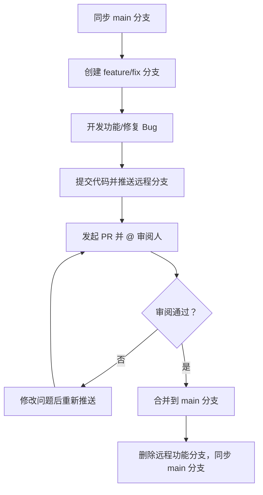

# 🎮 Cocos Creator 团队开发规范

本文档用于规范团队多人协作开发流程，保证代码和资源管理一致性，提高开发效率，所有团队成员需严格遵循。

---

## 1️⃣ 仓库与分支策略
### 1.1 核心分支定义
| 分支类型 | 分支名称 | 作用说明 | 操作限制 |
|----------|----------|----------|----------|
| 主分支 | `main` | 存放可发布的稳定版本代码，始终保持可运行状态 | 禁止直接 `push`，仅通过 PR/MR 合并 |
| 功能分支 | `feature/[功能名]` | 开发新功能（如角色系统、关卡模块） | 从 `main` 分支创建，开发完成后提交 PR |
| 修复分支 | `fix/[bug描述]` | 修复 `main` 或功能分支的 Bug（如闪退、逻辑错误） | 从对应问题分支创建，修复后提交 PR |
| 临时分支 | `test/[测试项]` | 用于临时测试功能兼容性（可选） | 测试完成后可删除，不合并到主分支 |

### 1.2 日常开发分支流程
1. **同步主分支最新代码**（每次开发前必做，避免冲突）：
   ```bash
   # 切换到本地 main 分支
   git checkout main
   # 拉取远程 main 分支最新代码
   git pull origin main
   ```
2. **创建功能/修复分支**：
   ```bash
   # 开发新功能：feature/后接清晰功能名（用连字符分隔）
   git checkout -b feature/player-movement
   # 修复 Bug：fix/后接 Bug 简要描述
   git checkout -b fix/login-crash
   ```
3. **分支提交与推送**：
   - 开发完成后，提交本地代码到远程个人分支
   ```bash
   # 添加修改文件
   git add .
   # 提交代码（需符合下方「提交规范」）
   git commit -m "[feat] 完成玩家上下左右移动功能"
   # 推送分支到远程仓库
   git push origin feature/player-movement
   ```
4. **发起 PR 合并请求**：
   - 在 GitHub/GitLab 平台找到自己推送的分支，发起「Pull Request」到 `main` 分支
   - PR 标题格式：`[分支类型] 功能/修复描述`（如 `[feature] 玩家移动功能`）
   - PR 内容需填写：功能说明、测试要点、相关联的需求/Bug 链接（如有），并 @ 至少 1 名审阅人


## 2️⃣ 代码提交规范
### 2.1 提交信息格式
```
[提交类型] 简短描述（不超过 50 字）
// 空行（可选）
详细说明（如实现逻辑、修改点，可选）
```

### 2.2 提交类型定义
| 类型标识 | 含义 | 示例 |
|----------|------|------|
| `feat` | 新功能开发 | `[feat] 新增关卡选择界面` |
| `fix` | Bug 修复 | `[fix] 修复玩家死亡后无法复活的问题` |
| `docs` | 文档修改（如本规范、README） | `[docs] 更新开发规范中的资源目录说明` |
| `refactor` | 代码重构（不改变功能，优化结构） | `[refactor] 简化玩家控制脚本逻辑` |
| `style` | 代码格式调整（无逻辑修改） | `[style] 统一脚本缩进为 2 空格` |
| `test` | 测试代码相关 | `[test] 添加玩家移动功能测试用例` |
| `chore` | 构建/工具配置修改（如依赖、.gitignore） | `[chore] 更新 Cocos 插件依赖版本` |

### 2.3 提交原则
- 单次提交粒度不宜过大，建议「一个小功能/一个 Bug 对应一次提交」，便于回滚和追溯
- 禁止提交自动生成的文件（如 `library/`、`temp/`，需通过 `.gitignore` 过滤）
- 提交前自我检查：代码是否符合项目风格、功能是否可运行、有无多余调试代码（如 `console.log` 未删除）


## 3️⃣ 资源与文件管理
### 3.1 目录结构规范
```
项目根目录/
├─ assets/               # 核心游戏资源（仅提交此目录下的手动创建资源）
│  ├─ textures/          # 图片资源（按模块分类，如 ui/、role/、map/）
│  │  ├─ ui/             # UI 图片（如按钮、弹窗背景）
│  │  └─ role/           # 角色图片（如待机、奔跑帧动画）
│  ├─ audio/             # 音频资源（按类型分类，如 bgm/、sound/）
│  ├─ prefabs/           # 预制体（按功能分类，如 ui/、role/、enemy/）
│  ├─ scripts/           # 脚本文件（按模块分类，需与类名一致）
│  │  ├─ player/         # 玩家相关脚本（如 PlayerCtrl.ts、PlayerData.ts）
│  │  └─ ui/             # UI 相关脚本（如 UILogin.ts、UIGame.ts）
│  └─ scenes/            # 场景文件（主场景、子场景分开）
│     ├─ Main.scene      # 主场景（仅做全局初始化、模块组合）
│     └─ Level1.scene    # 关卡场景（具体关卡内容）
├─ packages/             # Cocos 扩展插件（按需提交，非自动生成部分）
├─ settings/             # 项目配置（如构建配置、图层设置，需提交）
├─ .gitignore            # Git 忽略文件（必须配置，见下方）
└─ DEVELOPMENT_GUIDE.md  # 本开发规范文档
```

### 3.2 .gitignore 必配置项
```
# Cocos 自动生成目录
library/
temp/
build/
local/
.creator/
profiles/

# 开发工具配置
.vscode/
.idea/
*.sublime-project
*.sublime-workspace

# 依赖与日志
node_modules/
npm-debug.log
yarn-error.log

# 系统文件
.DS_Store                # Mac 系统文件
Thumbs.db                # Windows 系统文件
```

### 3.3 资源管理注意事项
- **命名规范**：所有文件/文件夹名统一使用「小写+连字符」（如 `player-ctrl.ts`、`ui-login.png`），禁止中文/特殊字符
- **Prefab 模块化**：复杂功能拆分为独立 Prefab（如「玩家Prefab」「敌人Prefab」），避免多人同时编辑同一 Prefab
- **资源冲突处理**：若多人修改同一资源（如 `.scene`、`.prefab`），先同步对方代码，手动合并冲突后再提交，禁止强制推送（`git push -f`）


## 4️⃣ 场景与 Prefab 开发规范
### 4.1 场景开发规则
1. 主场景（`Main.scene`）仅负责：
   - 全局管理器初始化（如 GameManager、AudioManager）
   - 场景切换逻辑（如从登录场景切到关卡场景）
   - 不存放具体关卡/UI 内容，避免多人编辑冲突
2. 子场景（如 `Level1.scene`、`UILogin.scene`）：
   - 每个子场景对应单一功能（关卡/UI面板）
   - 场景内引用的资源优先使用 Prefab，减少重复创建

### 4.2 Prefab 开发规则
1. 命名格式：`[模块名]_[对象名]`（如 `player_main`、`ui_login-btn`）
2. 内部结构：
   - Prefab 内脚本仅处理自身逻辑（如 `PlayerCtrl.ts` 只控制玩家自身移动、攻击）
   - 跨 Prefab 通信通过全局管理器（如 `EventManager`）发送事件，禁止直接引用
3. 编辑限制：同一时间仅允许 1 人编辑某个 Prefab，编辑前可在团队群告知，避免冲突


## 5️⃣ 代码规范
### 5.1 脚本基础规范
1. **语言与版本**：统一使用 TypeScript，遵循 ES6+ 语法规范
2. **文件命名**：采用 PascalCase（帕斯卡命名法），与类名完全一致（如 `PlayerController.ts`）
3. **编码格式**：
   - 缩进：2 个空格（禁止使用 Tab）
   - 行尾：LF（Unix 格式）
   - 文件编码：UTF-8
   - 语句结尾必须加分号 `;`

### 5.2 类与接口规范
```typescript
// 正确示例
export default class PlayerController extends cc.Component {
  // 成员变量声明
  private _speed: number = 5;
  private _isMoving: boolean = false;
  
  // 静态常量
  public static readonly MAX_HP: number = 100;
  
  // 生命周期函数放在最前面
  onLoad(): void {
    this.init();
  }
  
  start(): void {
    // 初始化逻辑
  }
  
  // 私有方法
  private init(): void {
    // 初始化代码
  }
  
  // 公共方法
  public move(direction: cc.Vec2): void {
    // 移动逻辑
  }
}

// 接口定义
interface DamageInfo {
  value: number;
  source: cc.Node;
}
```

### 5.3 变量与函数规范
1. **变量命名**：
   - 私有变量：`_camelCase`（下划线+小驼峰，如 `_currentHp`）
   - 公共变量：`camelCase`（小驼峰，如 `moveSpeed`）
   - 静态常量：`UPPER_SNAKE_CASE`（大写蛇形，如 `MAX_LEVEL`）

2. **函数命名**：
   - 普通函数：`camelCase`（小驼峰，如 `calculateDamage()`）
   - 事件回调：`on+事件名`（如 `onButtonClick()`）
   - 布尔返回值函数：`is/has/should+动词`（如 `isPlayerAlive()`）

3. **注释规范**：
   ```typescript
   /**
    * 玩家移动控制
    * @param direction 移动方向向量
    * @param isAccelerate 是否加速
    * @returns 是否成功移动
    */
   public move(direction: cc.Vec2, isAccelerate: boolean = false): boolean {
     // 临时调试代码（提交前必须删除）
     // console.log('移动方向:', direction);
     
     if (!direction) return false;
     
     // 移动逻辑实现
     return true;
   }
   ```

### 5.4 代码风格与最佳实践
1. **避免全局变量**：通过单例管理器（如 `GameManager.instance`）管理全局状态
2. **资源加载**：统一使用 `cc.resources.load()` 并封装到资源管理器，避免重复加载
3. **事件处理**：
   - 优先使用 Cocos 事件系统（`node.on()`）
   - 组件销毁时必须移除事件监听（`node.off()`）
4. **性能优化**：
   - 避免在 `update()` 中执行复杂计算
   - 频繁创建/销毁的对象使用对象池（`cc.NodePool`）
   - 大列表渲染使用滚动视图（`cc.ScrollView`）并实现复用

5. **错误处理**：
   ```typescript
   // 正确示例
   public loadPlayerData(id: number): void {
     if (id <= 0) {
       cc.error('无效的玩家ID:', id);
       return;
     }
     
     // 异步操作必须有错误处理
     api.getPlayerData(id)
       .then(data => this.onDataLoaded(data))
       .catch(err => cc.error('加载玩家数据失败:', err));
   }
   ```


## 6️⃣ PR 审阅与合并规范
### 6.1 PR 提交前置检查
提交 PR 前，需自行完成以下操作：
1. 同步主分支最新代码，解决本地冲突：
   ```bash
   # 切换到自己的功能分支
   git checkout feature/xxx
   # 合并 main 分支最新代码
   git merge origin main
   # 若有冲突，解决后提交
   git add .
   git commit -m "[chore] 合并 main 分支冲突"
   git push origin feature/xxx
   ```
2. 本地测试：确保功能可正常运行、无闪退/报错、符合需求设计
3. 附件要求：UI 相关修改需附截图/GIF，功能修改需说明测试步骤

### 6.2 审阅流程
1. 审阅人需在 1 个工作日内反馈审阅结果，主要检查：
   - 代码逻辑是否合理、有无潜在 Bug
   - 是否符合代码/资源命名规范
   - 功能是否满足需求，有无多余/遗漏代码
2. 若审阅不通过：
   - 审阅人需明确标注问题点（如代码行号、修改建议）
   - 开发人修改后重新推送代码，PR 会自动更新，无需重新创建
3. 合并条件：
   - 至少 1 名审阅人通过
   - 无未解决的冲突
   - 自动化测试通过（如有配置）

### 6.3 合并后操作
1. 合并人（建议项目负责人）完成合并后，需：
   - 在 PR 页面删除对应的远程功能分支（如 `feature/xxx`）
   - 告知团队成员「某功能已合并到 main 分支」
2. 其他成员需同步主分支更新：
   ```bash
   git checkout main
   git pull origin main
   ```


## 7️⃣ 其他核心注意事项
1. **版本统一**：所有成员必须使用 **同一版本的 Cocos Creator**（版本号记录在 README 中），避免因版本差异导致资源损坏
2. **大文件管理**：超过 100MB 的资源（如高清视频、大音效）需使用 Git LFS（需提前在仓库配置），或通过团队云盘共享，不直接提交到 Git
3. **每日同步**：建议每天下班前同步 main 分支代码，避免长期不同步导致大量冲突
4. **版本号管理**：遵循「主版本.次版本.修订号」规则（如 `1.0.0`），每次发布后在 main 分支打 Tag（如 `v1.0.0`），Tag 描述需包含发布内容
5. **问题沟通**：遇到冲突/技术问题，优先在团队群同步，避免独自修改导致代码混乱


---

## 💡 流程总结


> 开发前请务必阅读此规范，如有疑问或建议，可在团队群讨论更新。